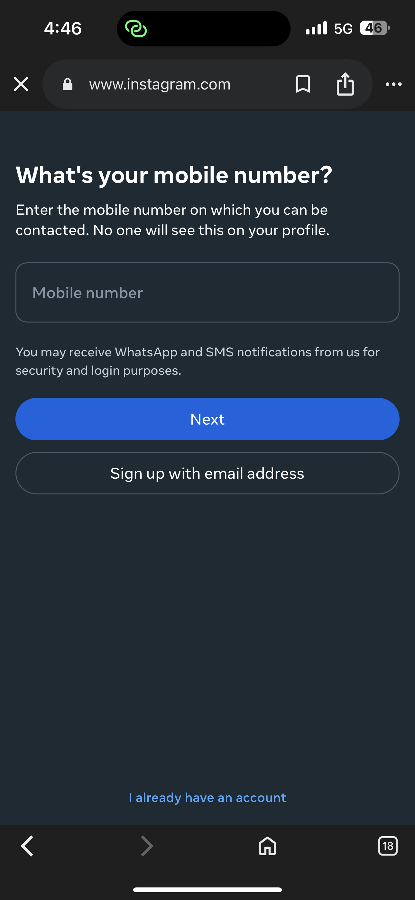

# Task-Oriented Documentation: Creating an Instagram Account

## Purpose
This document explains the steps required for a new user to create an Instagram account.

## Audience
This documentation is intended for first-time Instagram users who want to create a new account.

## Prerequisites
Before creating an Instagram account, the user must have:
- A smartphone with internet access
- The Instagram mobile application installed
- A valid email address or mobile phone number

## Task: Create an Instagram Account

### Steps

#### Step 1: Start the Sign Up process
The user opens the Instagram application and taps on the *Sign Up* option.

#### Step 2: Enter phone number or email

#### Step 3: Create username and password

1. Open the Instagram mobile application.
2. Tap on the *Sign Up* option.
3. Choose to sign up using a phone number or email address.
4. Enter the required details and tap *Next*.
5. Create a username and password.
6. Complete the profile setup (optional).
7. Tap *Done* to finish creating the account.
   
## Expected Result
The user successfully creates an Instagram account and is redirected to the home screen.
